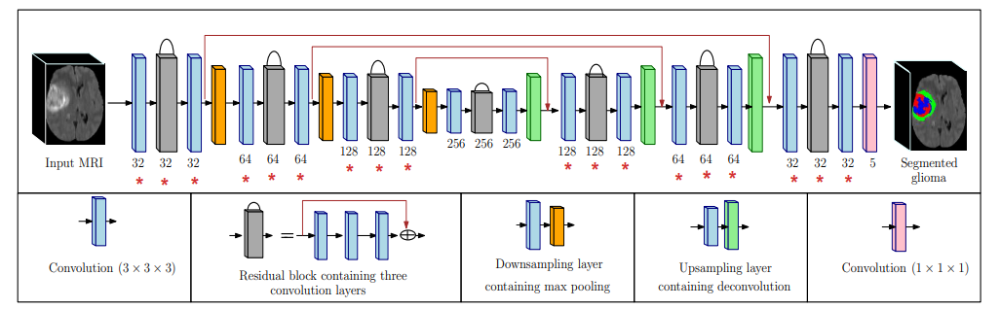
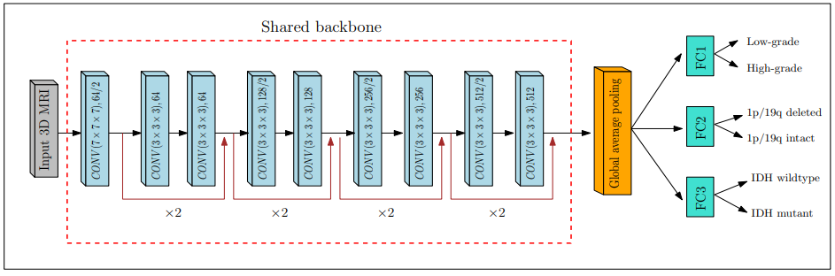
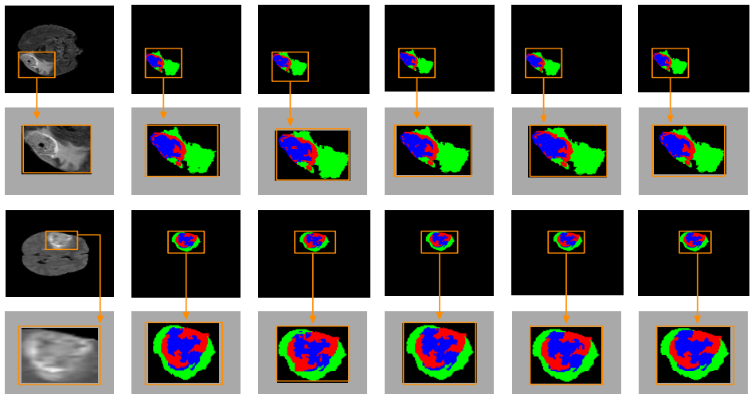

# Gliomanet
Research Paper: An attention-guided CNN framework for segmentation and grading of glioma using 3D MRI scans

Author names: Prasun Chandra Tripathi and Soumen Bag

Affiliations: University of Sheffield and  Indian Institute of Technology (ISM) Dhanbad

Under review in Journal: IEEE/ACM Transactions on Computational Biology and Bioinformatics

Prerequisites: Python 3.6, numpy 1.10+, pytorch 1.1.0

# Proposed networks

# Result

